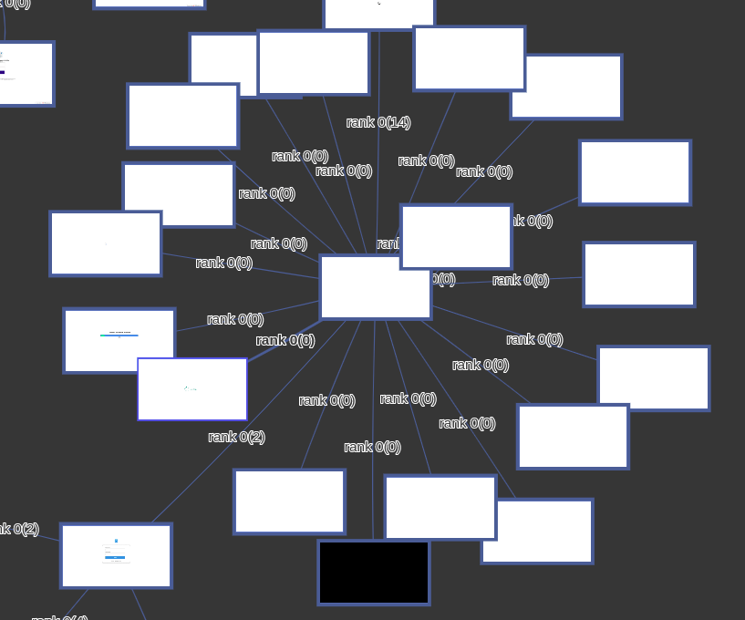
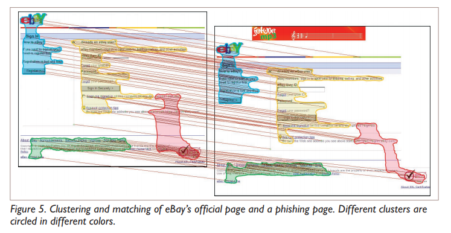
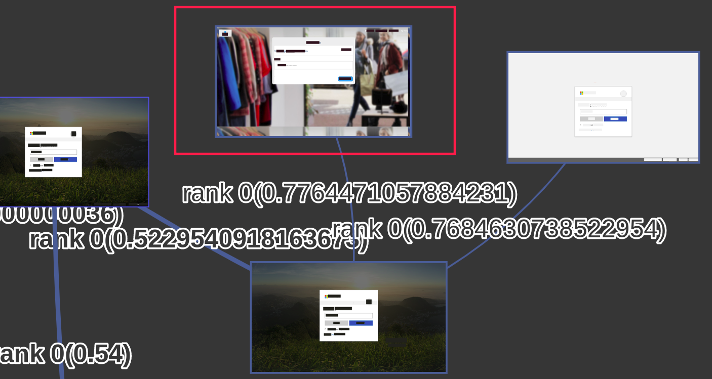

-   [Introduction](#introduction)
    -   [Goal](#goal)
    -   [Methodology](#methodology)
    -   [Problem Statement](#problem-statement)
-   [Classic Computer vision techniques - White box algorithms](#classic-computer-vision-techniques---white-box-algorithms)
    -   [Classic computer vision algorithm steps](#classic-computer-vision-algorithm-steps)
-   [Global Features Algorithms](#standard-algorithms)
    -   [Overview](#overview)
    -   [Categories](#categories)
    -   [Full region features - FH or CTPH - Fuzzy Hashing Algorithms](#full-region-features---fh-or-ctph---fuzzy-hashing-algorithms)
    -   [Per subregion features](#per-subregion-features)
-   [Local Features Algorithms](#standard-algorithms)
    -   [Comparison overview](#comparison-overview)
    -   [Feature detector](#feature-detector)
    -   [Feature descriptor](#feature-descriptor)
    -   [Feature detector and descriptor](#feature-detector-and-descriptor)
    -   [Feature matching](#feature-matching)
    -   [Image matching](#image-matching)
-   [Algorithms combination](#algorithms-combination)
    -   [Phishing](#phishing)
-   [Neural networks – Black box algorithms](#neural-networks-black-box-algorithms)
    -   [FAST – Features from Accelerated Segment Test](#fast-features-from-accelerated-segment-test)
    -   [CNN - Convolutional Neural Network](#cnn---convolutional-neural-network)
    -   [FRCNN - Faster RCNN](#frcnn)
    -   [RTSVMs - Robust Transductive Support Vector Machines](#rtsvms---robust-transductive-support-vector-machines)
    -   [RBM - Restricted Boltzmann machine](#rbm)
    -   [RPA - Robust Projection Algorith](#rpa)
    -   [Boosting SSC](#bssc)
    -   [ConvNet - Convolutional Neural Networks](#convnet---convolutional-neural-networks)
    -   [SVM - Support Vector Machine](#svm---support-vector-machine)
-   [Utility algorithms](#utility-algorithms)
    -   [SWS - Sliding Windows Search](#sws---sliding-windows-search)
    -   [ESS - Efficient Subwindow Search](#ess)
    -   [Segmentation](#segmentation)
    -   [Unsorted](#unsorted-1)
    -   [Raw results](#raw-results)

Introduction
============

##### Goal

The goal of this document is to provide an overview of the tools and ideas to cluster similar pictures or pictures with similar elements together. This document intents to provide State-of-the-art references, as well as library tests and results review. It may also give insights about combinaison or ideas to improve found ideas.

##### Methodology

A general overview was made through standard web lookup. \[9\] A look was given to libraries, which also provide detailed and useful information. \[62\]

In the following, we expose :

-   The main steps of a Image Matching algorithm

-   Few of the most popular Image Matching algorithms

##### Problem Statement

\[10\] states the Image Retrieval problem as “Given a query image, finding and representing (in an ordered manner) the images depicting the same scene or objects in large unordered image collections”

**Please, be sure to consider this document is under construction, and it can contain mistakes, structural errors, missing areas .. feel free to ping me if you find such flaw. (Open a PR/Issue/...)**

Classic Computer vision techniques - White box algorithms
=========================================================

Correspondances can be found between pictures, and so can be used for, e.g. : \[7\]:

1.  **Similarity Measurement** : probability of two images for showing the same scene

2.  **Geometry Estimation** : estimate the transformation between two object views

3.  **Data Association** : Sorting pictures by scene (TO CHECK : Same as Similarity measurement)

Block based approach : the image is divided into various blocks. These block division is done on the basis of Discrete Wavelet Transform, Discrete Cosine Transform, Zernike moment, and Fourier Mellin Transform. \[35\]

![Image maching pipeline from \[7\] ](sota-ressources/image-matching-pipeline.png)

Classic computer vision algorithm steps
---------------------------------------

### Step 1 - Interest / Key Point Detection

The goal of this sub-algorithm is to find relevant points in pictures, to encode them later as a representation of the original picture. These **keypoints** are encoded under various format.
PLEASE SEE BELOW THE LIST OF FEATURE DETECTOR

### Step 2 - Descriptor Extraction

The goal of this part is to extract a small patch around each keypoint, preserving the most relevant information and discaring unnecessary information (illumination ..)
Patches can be :

-   Pixels values

-   Histogram of gradient

-   Learnt To check

And are usually :

-   Normalized

-   Indexed in a data structure for fast lookup

##### Example

“Based on keypoints, each descriptor has size 64 and we have 32 such, so our feature vector is 2048 dimension.”

##### Descriptor’s quality

A good descriptor code would be, according to \[63\] :

-   easily computed for a novel input

-   requires a small number of bits to code the full dataset

-   maps similar items to similar binary codewords

-   require that each bit has a 50% chance of being one or zero, and that different bits are independent of each other

We should be aware that a smaller code leads to more collision in the hash.

### Step 3 - Feature representation

The goal of this step is to choose a relevant storage format for the descriptors. A local feature needs to be represented, precise \[46\]. To clarify

#### Bag-Of-Words or Bag-Of-Features or Codebook Generation

From \[46\], representing an image as a set of feature descriptor.

From \[19\], “The “**bag of features**” method is a “**bag of words**” analog, which is used in computer vision applications to build strong descriptions of an image. This approach usually includes key point feature detection (typically SIFT), quantization (clustering) of these features (typically with k-means) and distribution of key point features in the space of cluster centers in the form of a histogram (we refer to this procedure as “screening”). Recognition is usually performed by searching for a minimum distance between histograms.”

From \[46\], K-Means clustering over all words describing all pictures. A representative word (=Codeword) of each cluster is chosen (the “mean word”). A list of all representative words is created. A representative vector for each image, is created, as a boolean\_list/histogram of representative words linked or not to this image.

##### Pro

-   Insensitivity to objects location in image

-   Shorten the comparisons to do : less elements presence has to be verified. If a codebook is generated, the presence or absence of each word (= representative feature) in one image, can be encoded as a bitstring. To double check

##### Con

-   Loss of spatial information

-   Representation ambiguity : Codeword may not be representative of a cluster of words (too large, too narrow, more than 1 meaning, ...)

#### Soft Vector Quantization

From \[46\], **soft vector quantization** is a **Codebook Generation** with most and least frequent words removal. Each feature is then represented by a small group of codewords.

##### Pro

-   Mitigate the representation ambiguity problem of CodeBook

##### Con

-   Undo something that has been done ? Check meaning

#### Hierarchical CodeWords

From \[46\], keep spatial information about the neighboorhood of a codeword.

#### Visual sentences

Project codeword on a spatial axis. Relative spatial relation between words are kept.

#### SPM - Spatial Pyramid Matching

From \[46\], divide a picture into equal partitions (/4, /8, ..), compute a Bag-Of-Word for each partition, its histogram, and concatenate them into one big “ordered” histogram.

##### Pro

-   Keep spatial information of features

##### Con

-   Some “bad translation” can occurs, and split features into different Bag-of-words.

![3 levels spatial pyramid from \[46\] ](sota-ressources/spm.png)

#### L-SPM - Latent Spatial Pyramid Matching

From \[46\], based on SPM but does not split the picture in equal partition = the cell of the pyramid is not spatially fixed. Cells of the pyramid move within search regions instead of a predefined rigid partition. Use ESS (See utilities)

##### Con

-   High computational cost

### Step 4 - Feature storage and datastructure

Descriptors can be compressed before matching, especially to allow a fast retrieval.

#### LSH - Locally Sensitive Hashing

Use a fuzzy hash on feature representation allows a quick approximate lookup on indexed hash.\[64\]

-   O(N)

-   Returns the K (parameter) best matchs

-   Convert descriptor (floats) to binary strings. Binary strings matched with Hamming Distance, equivalent to a XOR and bit count (very fast with SSE instructions on CPU)

#### BBF - Best bin first Kd-tree

O(N)
Example : SIFT – Scale Invariant Feature Tranform To check ?

### Step 5 - Distance choice

This step will find a match between request picture and pictures of the dataset. Linked to correspondence problem ?

#### Hamming distance / Bruteforce

Partially solved by \[30\]
Works with binary features. Can be accelerated with GPU \[7\].

*O*(*N*2), N being the number of descriptor per image

One descriptor of the first picture is compared to all descriptor of a second candidate picture. A distance is needed. The closest is the match.
Usable with :

-   Ratio test Verify link

-   CrossCheck test : list of “perfect match” To check

#### FLANN - Fast Library for Approximate Nearest Neighboors

From \[7\], is an approximation for matching in Euclidian space, with KD-Tree techniques.
Work with non-binary features.

Verify following information link \[64\]

-   Collections of algorithm, optimized for large dataset/high dimension

-   Returns the K (parameter) best matchs

##### Implementation

Apache 2 From \[8\], available at : <https://github.com/nmslib/nmslib> \[60\] Does not benchmark memory usage.

### Step 6 - Matching and selection

This step will find a match between request picture and pictures of the dataset. Linked to correspondence problem ? Verify link Higly noisy correspondences need to be filtered.

Can return :

-   only the best match

-   the K (parameter) best matchs

#### RATIO (Lowe’s)

From \[7\] recognizes the distinctiveness of features by comparing the distance of their two nearest neighbors.
This test rejects poor matches by computing the ratio between the best and second-best match. If the ratio is below some threshold, the match is discarded as being low-quality.

#### GMS - Gird-based Motion Statistics

Uses the motion smoothness constraint. Equivalent to RATIO.
Robustness, accuracy, sufficiency, and efficiency of GMS all depend on the number of interest points detected.

#### QBH - Quantization Based Hashing

From \[40\] Incorporates quantization error into the conventional property preserving hashing models to improve the effectiveness of the hash codes

##### IMI - Inverted Multi-Index

To fill

##### NGS - Neighboorhood Graph Search

To fill

##### HNSW - Hierarchical Navigable Small Worlds

Graph based approach. Precise approximate nearest neighbor search in billion-sized datasets.
**Highly scalable** : “Indexing 1 billion vectors takes about 26 hours with L&C: we can add more than 10,000 vectors per second to the index. We refine at most 10 vectors.”

###### Implementation

BSD <https://github.com/facebookresearch/faiss> \[61\]

### Step 7 - Model Fitting

From \[7\] and \[62\], Model fitting is a step where the geometry of the scene is verified and/or estimated. Given correspondances, the pose of the object is estimated.

This allows to **identify inliers and outliers** by fitting a homography matrix, which is equivalent to find the transformation of (picture one) to (picture two)

We define :

-   Inliers : “good” points matching that can help to find the transformation

-   outliers : “bad” points matching

#### RANSAC - Random Sample Consensus

Estimation of the homography, searches for the best relative pose between images iteratively and removes outliers that disobey the estimated geometry relation finally. Correspondences that pass the geometry verification are named verified correspondences. Provides a robust estimation of transform matrix.
“RANSAC loop involves selecting four feature pairs randomly. It computes Homography H (mapping between any two points with the same center of projection). For each key point, there may be more than one candidate matches in the other processed image. We choose the best matching based on the distance between their descriptors” from \[1\]

#### Least Meadian

To fill

Global Features Algorithms
==========================

##### Overview

Global feature algorithms try to give a global and general descriptor for a given picture. Generally, this kind of approach is **weak against some transformation as occlusion**, clutter. It needs a fixed viewpoint, a clear background, an fixed pose. The main assumption is that the similar images in the Euclidean space must have similar binary codes. \[10\]

##### Categories

-   Locality Sensitive Hashing schemes (LSH) : To detail

-   Context Triggered Piecewise Hashing (CTPH) : To detail

Full region features - FH or CTPH - Fuzzy Hashing Algorithms
------------------------------------------------------------

##### Overview

These algorithms do not intend to match pictures with common part, but to match pictures which are roughly the same or are near copies of one another.
To be clear : If the hashes are different, then the data is different. And if the hashes are the same, then the data is likely the same. There is a possibility of a hash collision, having the same hash values then does not guarantee the same data. \[39\] specifies that Context Triggered Piecewise Hashing (CTPH) is a combination of Cryptographic Hashes (CH), Rolling Hashes (RH) and Piecewise Hashes (PH).

##### Misc. notes

-   Discrete Cosine Transformation (CDT) may be worst than Discrete Wavelet Transformation (DWT).

-   SDHash seesm the more accurate, but the slower. Cross-reference seems a good way to go.

##### Examples

-   Holistic features (=“Spatial enveloppe” = naturalness, openness, roughness, ruggedness, expansion ..)

-   Colors histograms

-   “Global Self-Similarity” (=spatial arrangement)

An results overview is presented below.

![Results of (a/b/d/m/p/w)-Hash from \[65\] - Lower score is better](sota-ressources/outputs-evaluation/results_0.png)

### A-HASH : Average Hash

##### Overview

From ... \[49\] : “the result is better than it has any right to be.”

There exist relationship between parts of the hash and areas of the input image, that provide ability to apply “masks” (like “ignore the bottom 25% of the image”.) and “transformations” at comparison time. (searches for rotations in 90degree steps, mirroring, inverts...). Eahc picture is hashed into a 8 bits vector.

Idea to be faster (achieve membw-bound conditions) : Batch search (compare more than one vector to all others) = do X search at the same time. More than one vector could be transformation of the initial image (rotations, mirrors). Therefore a “rotation, mirrored, etc.” search of a request picture can be performed.

##### Pro

-   Masks and transformation available

-   Ability to look for modified version of the initial picture

-   Only 8 bits for a image vector.

##### Implementation

ImageHash 4.0 <https://pypi.org/project/ImageHash/>
Javascript Implementation : \[3\]

##### Results

Results given by the ImageHash implementation of A-hash algorithm are not reliable.

0.99 

0.99 

0.99 

0.99 

0.49 

0.45 

0.7 

### B-HASH : Block Hash

Seems worst than A-hash. Not tested, then.

##### Implementation

\[66\] <http://blockhash.io> and <https://github.com/commonsmachinery/blockhash-python>

### D-HASH - Difference Hashing

From \[21\], DHash is a very basic algorithm to find nearly duplicate pictures. The hash can be of length 128 or 512 bits. The istance between 2 vector is a Hamming distance (number of different bits.)

##### Pro

-   Detecting near or exact duplicates : slightly altered lighting, a few pixels of cropping, or very light photoshopping

##### Con

-   Not for similar images

-   Not for duplicate-but-cropped

##### Steps of the algorithm

1.  Convert the image to grayscale

2.  Downsize it to a 9x9 thumbnail

3.  Produce a 64-bit “row hash”: a 1 bit means the pixel intensity is increasing in the x direction, 0 means it’s decreasing

4.  Do the same to produce a 64-bit “column hash” in the y direction

5.  Combine the two values to produce the final 128-bit hash value

##### Implementation

ImageHash 4.0 <https://pypi.org/project/ImageHash/>

##### Results

Results given by the ImageHash implementation of D-hash algorithm does not provides reliable results, but better than a-hash results.

0.39 

0.60 

0.3 

0.66 

###### “Vertical” variation

A variation of the d-hash algorithm is available, as d-hash vertical.

0.42 

0.56 

### P-HASH - Perceptual Hash

From ... \[49\] and \[24\] and \[51\]. Exist in mean and median flavors, provides a 8 bits vector for each image.

##### Pro

-   Robustness to gamma

-   Robustness to color histogram adjustments

-   Should be robust to rotation, skew, contrast adjustment and different compression/formats.

-   , C++, API

##### Steps of the algorithm

1.  Reduce size of the input image to 32x32 (needed to simplify DCT computation)

2.  Reduce color to grayscale (same)

3.  Compute the DCT : convert image in frequencies, a bit similar to JPEG compression

4.  Reduce the DCT : keep the top-left 8x8 of the DCT, which are the lowest frequencies

5.  Compute the average DCT value : without the first term (i.e. solid colors)

6.  Further reduce the DCT : Set the 64 hash bits to 0 or 1 depending on whether each of the 64 DCT values is above or below the average value.

7.  Construct the hash : create a 64 bits integer from the hash

8.  Comparing with Hamming Distance (threeshold = 21)

##### Implementation

ImageHash 4.0 <https://pypi.org/project/ImageHash/>
Java implementation : \[50\]

##### Results

Still some strange results

0.52 

0.47 

##### “Simple” variation

A variation of the p-hash algorithm is available, as p-hash simple.

0.55 

0.44 

### W-HASH - Wavelet Hash

From ... Uses DWT instead of DCT. To detail

##### Implementation

ImageHash 4.0 <https://pypi.org/project/ImageHash/>

##### Results

Better than others, but still some strange/wrong results.

0.55 

0.44 

0.8 

### SimHash - Charikar’s simhash

From ... \[30\]
Repository of 8B webpages, 64-bit simhash fingerprints and k = 3 are reasonable.
Has a C++ Implementation

### R-HASH

From ... \[49\]

Equivalent to A-Hash with more granularity of masks and transformation. Ability to apply “masks” (color channel, ignoring (f.ex. the lowest two) bits of some/all values) and “transformations” at comparison time. (color channel swaps)

48 bits for a rgb image vector

##### Pro

-   Masks and transformation available

-   More precise masks (than A-hash)

-   More precise transformations (than A-hash)

##### Con

-   Larger memory footprint

##### Steps of the algorithm

1.  Image scaled to 4x4

2.  Compute vector

3.  Comparison = sum of absolute differences: abs(a\[0\]-b\[0\]) + abs(a\[1\]-b\[1\]) + ... + abs(a\[47\]-b\[47\]) = 48 dimensional manhattan distance

### Spectral-HASH

From \[63\]. A word is given in \[49\]

The bits are calculated by thresholding a subset of eigenvectors of the Laplacian of the similarity graph

Similar performance to RBM

![Spectral Hashing comparison from \[63\] ](sota-ressources/spectral_hashing_comparison.png)

### LSH - Locality Sensitve Hashing

Same as E2LSH ? Chooses random projections so that two closest image samples in the feature space fall into the same bucket with a high probability, from \[10\]

### E2LSH - LSH - Locality Sensitve Hashing

From \[18\] a word is given in \[63\] and \[10\].
The code is calculated by a random linear projection followed by a random threshold, then the Hamming distance between codewords will asymptotically approach the Euclidean distance between the items.

Not so far from Machine Learning Approaches, but outperformed by them.

##### Pro

-   Faster than Kdtree

##### Con

-   Very inefficient codes (512 bits for a picture (TO CHECK))

### Nilsimsa hash - Locality sensitive hash

A word in \[34\] To detail

##### Pro

-   Open Source

### TLSH - Trend Micro Locality Sensitive Hashing

From \[34\] directly performed on file, not only pictures. Therefore, running TLSH on PNG can’t provide consistent results, as the structure of the file is taken into account (and so it’s meaningless compression). Files have to be uncompressed (e.g. some types of BMP files) to have consistent resuls with TLSH.

##### Pro

-   Parametered threeshold (below 30 in original paper)

-   Open Source

0.59 

0.40 

0.51 

0.48 

0.49 

0.50 

0.51 

0.47 

0.65 

0.65 

0.50 

### SSDeep - Similarity Digest 

From ... few words on it in \[39\]. C implementation at \[59\] Historically the first fuzzing algorithm. CTPH type. To detail

![ Hashing time from \[26\] ](sota-ressources/ssdeep_time.png)

##### Pro

-   Effective for text (Spam, ..)

-   Open Source

##### Con

-   Not effective for Images, Videos, ...

-   Les effective than Sdhash

##### Steps of the algorithm

1.  Rolling hashing to split document into “6 bits values segments”

2.  Uses hash function (MD5, SHA1, ..) to produce a hash of each segment

3.  Concatenate all hashes to create the signature (= the fuzzy hash)

### SDHash - Similarity Digest Hash

From ... Roussev in 2010 few words on it in \[39\]

Uses Bloom Filters to identify similarities between files on condition with common features. (Quite blurry)

##### Pro

-   More accurate than VHash, SSDeep, MRSHV2

-   Options available (TO CHECK) - See a particular implementation used in \[39\]

-   Open Source

##### Con

-   Slow compared to MVHash, SSDeep, MRSHV2

##### Steps of the algorithm

1.  Perform a hash/entropy To check calculation with a moving window of 64 bits.

2.  Features (? How are they recognized?) are hashed with SHA-1

3.  Features are inserted into a Bloom Filter

### MVHash - Majority Vote Hash

From ... few words on it in \[39\]

It is Similarity Preserving Digest (SPD) Uses Bloom Filters

##### Pro

-   Almost as fast as SHA-1 (paper)

##### Steps of the algorithm

1.  Majority vote on bit level (transformation to 0s or 1s)

2.  RLE = Run Length Encoding, represents 0s and 1s by their length

3.  Create the similarity digest To check

### MRSH V2 - MultiResolution Similarity Hashing

From ... few words on it in \[39\]
Variation of SSDeep, with polynomial hash instead of rolling hash (djb2)

##### Pro

-   Fast than SDHash

##### Con

-   Slow compared to MVHash, SSDeep

### GIST - 

From \[33\] a word in \[28\]

Holistic feature which is based on a low dimensional representation of the scene that does not require any form of segmentation, and it includes a set of perceptual dimensions (naturalness, openness, roughness, expansion, ruggedness)

Per subregion features
----------------------

**Per subregion** Example : Histogram of Oriented Gradients (HOG)

Holistic feature ...

### HOG - Histogram of Oriented Gradients

From ... A word in \[46\] The idea is to describe shape information by gradient orientation in localized sub-regions. To detail

### Contrast context histogramm

From \[23\] Define a descriptor based on a contrast histogramm of keypoints. To detail

Local Features Algorithms
=========================

Goal is to transform visual information into vector space

Comparison overview
-------------------

![Benchmarking of SIFT, SURF, ORB, AKAZE with RATIO and GMS selection ; FLANN or Hamming for distance. SP curves show the success ratio or success number (number of correspondance for AP) with thresholds. X-Axis being the threeshold. AP curves illustrate the mean number of verified correspondences with thresholds. \[7\] ](sota-ressources/benchmarking_1.png)

![Benchmarking of SIFT, SURF, ORB, AKAZE, BRISK, KAZE with computation time. Ordered best time from best to worst : red, green, blue, black. \[7\] ](sota-ressources/benchmarking_2.png)

![Benchmarking of SIFT, SURF, ORB, AKAZE, BRISK, KAZE on robustness (RS), accuracy (AS), sufficiency (SS). Ordered best time from best to worst : red, green, blue, black. \[7\] ](sota-ressources/benchmarking_3.png)

In few words :

-   **Robustness**
    Success ratio (15difference max from real position) = Succes to match pairs
    Non-binary are better than binaries algorithms. Number of interest points change the best matching method to choose.

-   **Accuracy**
    Success ratio (5difference max from real position) = Are pairs are matched “for sure”
    Non-binary are better than binaries algorithms

-   **Sufficiency**
    Mean number of correctly geometric matched pairs.
    ORB-GMS is the best.

-   **Efficiency**
    Feature detection time + Feature matching time.
    ORB and BRISK are the fastest, KASE the slowest.

Some more comparisons are performed in \[52\] about robustness of different algorithms.

0.49 

0.49 

0.49 

0.49 

A large performance overview has been operated by \[43\]. Many information are extracted from their tests and are showed on each algorithm description.The paper is ordering algorithms thanks to different objective.

**Ability to detect high quantity of features** :
*O**R**B* &gt; *B**R**I**S**K* &gt; *S**U**R**F* &gt; *S**I**F**T* &gt; *A**K**A**Z**E* &gt; *K**A**Z**E*

**Computational efficiency of feature-detection-description per feature-point :**
*O**R**B* &gt; *O**R**B*(1000)&gt;*B**R**I**S**K* &gt; *B**R**I**S**K*(1000)&gt;*S**U**R**F*(64*D*)&gt;*S**U**R**F*(128*D*)&gt;*A**K**A**Z**E* &gt; *S**I**F**T* &gt; *K**A**Z**E*

**Efficient feature-matching per feature-point :**
*O**R**B*(1000)&gt;*B**R**I**S**K*(1000)&gt;*A**K**A**Z**E* &gt; *K**A**Z**E* &gt; *S**U**R**F*(64*D*)&gt;*O**R**B* &gt; *B**R**I**S**K* &gt; *S**I**F**T* &gt; *S**U**R**F*(128*D*)

**Speed of total image matching :**
*O**R**B*(1000)&gt;*B**R**I**S**K*(1000)&gt;*A**K**A**Z**E* &gt; *K**A**Z**E* &gt; *S**U**R**F*(64*D*)&gt;*S**I**F**T* &gt; *O**R**B* &gt; *B**R**I**S**K* &gt; *S**U**R**F*(128*D*)

![Results from \[43\] - Time cost - mean value on original paper dataset](sota-ressources/performance_algo.png)

Feature detector
----------------

“The choice of the convenient feature detector depends firstly on the nature of the problem.” \[1\] It mainly depends on the property to be verified : scale invariance, rotation invariance ...

#### Harris Detector

From the original paper \[22\].
Based on the main principle that at a corner, the **image intensity** will change largely in multiple directions, with a windows shift. \[46\] says it is invariant to rotation, scale, illumination, noise .. Scale invariance is probably obtained by a variation of the original algorithm (increase gaussian blur many time, automatic scale selection ..)
“Harris is a corner detector based on Moravec algorithm, which is proposed by Harris and Stephens in 1988. A detecting window in the image is designed. The average variation in intensity is determined by shifting the window by a small amount in a different direction. The center point of the window is extracted as a corner point.” from \[1\]

##### Pro and cons

-   Rotation-invariant

-   NOT scaling invariant
    One point could be a corner in a small scaled neighborhood, or as an edge in a large scaled neighborhood.

Kind of descriptor ?

#### GoodFeaturesToTrack

To detail
Kind of descriptor ?

“It expands the Harris detector to make its corners more uniformly distributed across the image. Shi and Tomasi showed how to monitor the quality of image features during tracking. They investigated a measure of feature dissimilarity that quantifies how much the appearance of a feature changes between the first and the current frame.” from \[1\]

#### CSS - Curvature Space Scale

To detail
Kind of descriptor ?

#### Hit and Miss filter

To detail
Kind of descriptor ?

#### Shi/Tomasi

To detail
Kind of descriptor ?

#### MSER

To detail
Kind of descriptor ?

“MSER stands for Maximally Stable Extremal Regions Detector. It was generated by Matas et al. to find matching between image elements from two input images from different viewpoints. The ’maximally stable’ in MSER describes the property optimized in the threshold selection process. The word ’extremal’ refers to the property that all pixels inside the MSER may be either higher or lower intensity than all the pixels on its outer environment.” from \[1\]

#### SUSAN

From ... a word in \[37\]
Less accuracy but faster. To detail
Kind of descriptor ?

#### FAST - Features from Accelerated Segment Test

From the original paper \[37\] cited in \[53\]
Is a corner detector, based on machine learning. More accuracy, kept with high speed. Based on SUSAN
“FAST is a high-speed feature detector that is much suitable for real-time applications. The algorithm considers a circle of 16 pixels around the candidate corner p. A feature is specified when a set of n contiguous pixels in the circle are all darker or brighter than the candidate pixel p plus a threshold t” from \[1\]

##### Pro

-   High repeatability

-   Scaling invariant To check

##### Con

-   Not rotation-invariant (no orientation calculation)

-   Not scale invariant

-   Not robust to high levels noise

-   can respond to 1 pixel wide lines

-   dependent on a threshold

Kind of descriptor ?

#### Bag Of Feature

To detail + Not sure it’s a feature detector ! 

Feature descriptor
------------------

Feature detector and descriptor
-------------------------------

### Unsorted

#### BRISK - 

To detail
Kind of algo ?

#### AKASE - 

To detail
Kind of algo ?

#### CenSurE

To detail
Kind of algo ?

#### KASE - 

Shipped in OpenCV library. Example can be found at \[31\] To detail
Kind of algo ?

### Non-binary features / Vector descriptor

#### SIFT- Scale Invariant Feature Transform

From the original paper \[29\] and a concise explanation from \[54\] 3x less fast than Harris Detector

SIFT detects scale-invariant key points by finding local extrema in the difference-of-Gaussian (DoG) space. \[28\]
Each key point is described by a 128-dimensional gradient orientation histogram. Subsequently, all SIFT descriptors are modeled/quantized using a bag-of-words (BoW). The feature vector of each image is computed by counting the frequency of the generated visual words in the image.

Interesting “usability” notices are presented in \[42\], as skiping first octave features, ...
“SIFT proposed by David Lowe and then improved in 2004. Currently, it is the most common known vector descriptor. It consists of four essential stages: scale-space extrema detection, key points localization, orientation assignment, and generating keypoint descriptor. In the first stage, the key points are extracted based on their strength that are invariant to orientation and scale using Difference of Gaussian. In the second stage, the wrong points are removed. Then in the following stage, one or more orientations are assigned to each keypoint. In the final stage, a vector descriptor is made for each keypoint.” from \[1\]

##### Pro

-   “SIFT is \[...\] most accurate feature-detector descriptor for scale, rotation and affine variations (overall).” \[43\]

-   invariant to scale and rotational variation

##### Con

-   and not included in OpenCV (only non-free module)

-   Slow : “a general perception that SURF is computationally efficient than SIFT, but the experiments revealed that SURF(128D) algorithm takes more time than SIFT(128D)” \[43\]

##### Steps of the algorithm

1.  Extrema detection

    Uses an approximation of LoG (Laplacian of Gaussian), as a Difference of Gaussion, made from difference of Gaussian blurring of an image at different level of a Gaussian Pyramid of the image. Kept keypoints are local extrema in the 2D plan, as well as in the blurring-pyramid plan.

2.  Keypoint localization and filtering

    Two threesholds has to be set :

    -   Contract Threeshold : Eliminate low contract keypoint ( 0.03 in original paper)

    -   Edge Threeshold : Eliminate point with a curvature above the threeshold, that could match edge only. (10 in original paper)

3.  Orientation assignement

    Use an orientation histogram with 36 bins covering 360 degrees, filled with gradient magnitude of given directions. Size of the windows on which the gradient is calculated is linked to the scale at which it’s calculated. The average direction of the peaks above 80% of the highest peak is considered to calculate the orientation.

4.  Keypoint descriptors

    A 16x16 neighbourhood around the keypoint is divided into 16 sub-blocks of 4x4 size, each has a 8 bin orientation histogram. 128 bin are available for each Keypoint, represented in a vector of float, so 512 bytes per keypoint. Some tricks are applied versus illumination changes, rotation.

5.  Keypoint Matching

    Two distance calculation :

    -   Finding nearest neighboor.

    -   Ratio of closest distance to second closest is taken as a second indicator when second closest match is very near to the first. Has to be above 0.8 (original paper) (TO CHECK what IT MEANS)

#### SIFT-FLOW

From \[17\], realize in motion prediction from a single image, motion synthesis via object transfer and face recognition.

##### Implementation

SIFT Flow (modified version of SIFT) C++ \[67\] at <http://people.csail.mit.edu/celiu/SIFTflow/>

#### Root-SIFT

From \[4\]
Better performances as SIFT, but no implementation found.

#### SURF – Speeded-Up Robust Features

\[6\] Use the BoWs to generate local features.
“The SURF algorithm was proposed by Bay et al. \[7\]. It is built upon the SIFT, but it works by a different way for extracting features. SURF is based on multi-scale space theory and speeds up its computations by fast approximation of Hessian matrix and descriptor using “integral images”. Haar wavelets are used during the description stage” from \[1\]

##### Pro

-   Faster than SIFT (x3) : Parralelization, integral image ..

-   Tradeoffs can be made :

    -   Faster : no more rotation invariant, lower precision (dimension of vectors)

    -   More precision : **extended** precision (dimension of vectors)

-   Good for blurring, rotation

-   illumination invariance

##### Con

-   -   Not good for illumination change, viewpoint change

##### Steps of the algorithm

1.  Extrema detection Approximates Laplacian of Guassian with a Box Filter. Computation can be made in parrallel at different scales at the same time, can use integral images … Roughly, does not use a gaussian approximation, but a true “square box” for edge detection, for example. The sign of the Laplacian (Trace of the Hessian) give the “direction” of the contrast : black to white or white to black. So a negative picture can match with the original ? (TO CHECK)

2.  Keypoint localization and filtering

3.  Orientation assignement Dominant orientation is computed with wavlet responses with a sliding window of 60

4.  Keypoint descriptors Neighbourhood of size 20sX20s is taken around the keypoint, divided in 4x4 subregions. Wavelet response of each subregion is computed and stored in a 64 dimensions vector (float, so 256 bytes), in total. This dimension can be lowered (less precise, less time) or extended (e.g. 128 bits ; more precise, more time)

5.  Keypoint Matching

#### U-SURF – Upright-SURF

Rotation invariance can be “desactivated” for faster results, by bypassing the main orientation finding, and is robust up to 15rotation.

#### TOP-SURF

From \[44\] and a word in \[**???**\]

Based on the BoW approach. Library provided with the paper under an open-source license. This seems a very promising tool to implement a BoW approach.

\[**???**\] describing it as : “\[This method\] was introduced as a method to combine key point features with visual word representation. Many features (over 33 million) were clustered in order to form up to 500,000 clusters (the lowest amount was 10,000). The sequence of such clusters is called a “visual word dictionary”. Separate weight was assigned to each word to take into account its frequency. The recognition stage included the mapping of each key point feature of an input image to the closest visual word forming the weighted histogram of words. Only top N words were left as a final image descriptor; then, the distance between such descriptors could be computed to compare the images.”

##### Pro

-   Open-source

-   Existing library

##### Con

-   C++ API

#### GSSIS - Generalized Scale-Space Interest Points

From \[56\], generalized interest point, with colors exension, of SIFT and SURF.

Roughly : uses more complicated way of generating local interest points.

##### Pro

-   Scale-invariant

#### LBP - Local Binary Pattern

From \[28\], use the BoWs to generate local features

### Binary features / Binary descriptor

#### ORB – Oriented FAST and Rotated BRIEF

From \[38\] which is rougly a fusion of FAST and BRIEF. See also \[55\] The threeshold of 0.75 (Lowe ratio) should be modified for ORB. 0.89 seems to be the equivalent to 0.75
“ORB technique developed by Rublee et al. It is a combination of features from FAST keypoint detection and Binary Robust Independent Elementary Features (BRIEF) descriptor. It describes the features of the input image in a binary string instead of the vector.” from \[1\]

##### Pro

-   Not patented

##### Steps of the algorithm

1.  Extrema detection

    FAST algorithm (no orientation)

2.  Keypoint localization and filtering

    Harris Corner measure : find top N keypoints

    Pyramid to produce multi scale features

3.  Orientation assignement

    The direction is extracted from the orientation of the (center of the patch) to the (intensity-weighted centroid fo the patch). The region/patch is circular to improve orientation invariance.

4.  Keypoint descriptors

    R-BRIEF is used, as Brief Algorithm is bad at rotation, on rotated patches of pixel, by rotating it accordingly with the previous orientation assignement.

5.  Keypoint Matching

    Multi-probe LSH (improved version of LSH)

###### Option explanation

Mostly from \[57\], \[68\] :
To be clear :

-   **Target picture** = request picture = new picture = picture we want to find correlation on

-   **Candidate picture** = stored picture = old pictures = pictures already parsed, prepared and stored, to find correlation on.

Perform a feature matching :

-   **Brute-Force matcher**, with bf.match(), is simple. It takes the descriptor of one feature of the target picture and is evaluated with all other features of all candidate pictures, using some distance calculation. The closest one is returned. It returns a list of matches. Use crossCheck=True.

-   **KnnMatch**, with bf.knnMatch(), returns for each descriptor of the target picture, the n-best matches with descriptors of a candidate picture. It searches for N-best candidate for each descriptor. It returns list of a list of matches. Use crossCheck=False and then do the ratio test.

Remove outliers and bad matches :

-   **CrossCheck** is an alternative to the ratio test. Cross-check does matching of two sets of descriptors D1 and D2 in both directions (D1 to D2 and D2 to D1) retaining matches that exists in both.

-   A **ratio test** can be performed on each k-uplets. Repetitive patterns are detected if the distance between one descriptor of the target picture is the same with the two best descriptors of the candidate picture. 2 points on the candidate picture matched 1 point on the target picture.

**RANSAC** filter matches. (TO CHECK)

Print nice graphs :

-   **cv2.drawKeypoints()** to draw keypoints

-   **cv2.drawMatches()** helps us to draw the matches. It stacks two images horizontally and draw lines from first image to second image showing best matches.

-   **cv2.drawMatchesKnn** draws all the k best matches. If k=2, it will draw two match-lines for each keypoint.

###### Analysis

Distance can be computed in many ways. Here is an analysis of each of the used distances.

-   Min length : the number of matches divided by the minimal number of descriptors of both pictures.
    This doesn’t work well, because if one of both pictures has a low number of descriptors, it will act as an “attractor” : this picture will be the closest one of many other one. It does not use the “internal distance of a match” : the distance of one descriptor to the other.

-   Max length : the number of matches divided by the minimal number of descriptors of both pictures.
    This works pretty well, removing the issue encountered by the min length. However it does not use the “internal distance of a match” : the distance of one descriptor to the other.

-   Mean of matches : it makes use of the “internal distance of a match” : the distance of one descriptor to the other. The distance between two pictures is computed as the mean of the matches distance. This doesn’t work well, for the same reason as min-length : if one of both pictures has a low number of descriptors, it will act as an “attractor” : this picture will have very few matches with others, but this small set of matches will have very “good distances”.

A question remains, about “How to select good and batch matches”. Ratio approach (as in SIFT) are for example usable. A simple threeshold can be used :

![Threeshold to use from \[69\]](sota-ressources/threeshold.png)

0.58 

0.43 

0.6 

0.51 

0.48 

0.8 

0.51 

0.48 

0.8 

Following pictures are showing drawbacks of ORB algorithm. As a first “general overview” of some matching results, few examples with commentary are giv en below. Tests were performed in “ratio” configuration, however, drawbacks are generalized to other submethods.
Few tips to analyze following pictures :

-   **Parrallel lines** (if there is not rotation) are a indicator of quality matching. It keeps the spatial consistency between source and candidate pictures.

-   **Text** seems to be a problem. Letters are matched to letters, generating false positive. It also “uses” descriptor space (number of descriptors is artificially limited), and so, hinders true logo (for example) to be described and used.

0.58 

0.37 

0.4 

0.59 

0.49 

0.50 

1 

1 

1 

1 

0.5 

0.48 

#### BRIEF – Binary Robust Independent Elementary Features

Extract binary strings equivalent to a descriptor without having to create a descriptor

See BRIEF \[70\]

##### Pro

-   Solve memory problem

##### Con

-   Only a keypoint descriptor method, not a keypoint finder

-   Bad for large in-plan rotation

##### Steps of the algorithm

1.  Extrema detection

2.  Keypoint localization and filtering

3.  Orientation assignement

4.  Keypoint descriptors

    Compare pairs of points of an image, to directly create a bitstring of size 128, 256 ou 512 bits. (16 to 64 bytes)

    Each bit-feature (bitstring) has a large variance ad a mean near 0.5 (TO VERIFY). The more variance it has, more distinctive it is, the better it is.

5.  Keypoint Matching Hamming distance can be used on bitstrings.

#### R-BRIEF – Rotation (?) BRIEF

Variance and mean of a bit-feature (bitstring) is lost if the direction of keypoint is aligned (TO VERIFY : would this mean that there is a preferential direction in the pair of point selection ? )

Uncorrelated tests To detail are selected to ensure a high variance.

Feature matching
----------------

#### PSO

From ... few words in \[32\] To detail
Kind of algo ?

#### SKF

From \[32\]

Faster than PSO. To detail
Kind of algo ?

#### RPM - Robust Point Matching

From ... Few words in \[45\] Unidirectional matching approach. Does not “check back” if a matching is correct. Seems to achieve only the transformation (geometry matching) part.

To detail
Kind of algo ?

#### Delaunay Graph Matching

Algorithm from 2012, quite advanced. Would need some tests or/and review See M1NN \[16\] that is presenting 3 algorithms :

- **M1NN Agglomerative Clustering**
Different types of data,robust to noise, may ’over’ cluster. Better clustering performance and is extendable to many applications, e.g. data mining, image segmentation and manifolding learning.

- **Modified Log-likelihood Clustering**
Measure and compare clusterings quantitatively and accurately. Energy of a graph to measure the complexity of a clustering.

- **Delaunay Graph Characterization and Graph-Based Image Matching**
Based on diffusion process and Delaunay graph characterization, with critical time. Graph-based image matching method. SIFT descriptors also used. Outperforms SIFT matching method by a lower error rate.

##### Pro

-   Lower error

-   Extensible to 3D (but not done yet ?)

##### Con

-   Lower number of matches

#### Fast Spectral Ranking

From \[25\] Seems to have quite fast result, ranking algorithm. Still dark areas over the explanations.

#### GHM - Generalized Hierarchical Matching Framework

From \[12\] Roughly, the algorithm split the input picture into interest areas, and then do matching on these different areas.

This tries to achieve a object-oriented recognition. It uses Saliency Map.

This To check is a non-rectangle version of SPM.

![Hierarchical Hashing as showed in \[12\] ](sota-ressources/hierarchical-matching.png)

##### Steps of the algorithm

1.  Multiple scale detection is performed in each image and the obtained multi-scale scores are averaged to get final single object confidence map.

Image matching
--------------

To detail
Kind of descriptor ?

Algorithms combination
======================

Few sources expose algorithms combination for specific goals. e.g. \[5\], \[71\], \[58\]

Phishing
--------

Classification of approaches :

-   Non-content based methods : URL, whois, ..

-   Content-based methods : text, images, HTML, js, css, ...
    Sensitive to image injection instead of DOM, of invisible characters, ...

-   Visual similarity and image processing methods

-   Hybrid methods

“scale and rotation invariance \[...\] are rarely seen in phishing pages because the pages must be very similar to the corresponding authentic pages to deceive unsuspecting users. ” \[11\]

### Visual similarity - Histogramm

“Web pages \[...\] usually contain fewer colors than paintings or photographs \[and\] have similar color distributions” from \[11\]. They also state that add banners add a high amount of “color histogram” noise.

### Visual similarity - Hash

### Visual similarity - Keypoints

\[11\] is presenting keypoints based phshing website detection named L-CCH. L-CCH uses Harris-Laplacian corners detection on gray scale pictures, and store keypoint as Contrast Context Histograms. They also highlight “to judge two Web pages’similarity, we must consider \[keypoints\] spatial distribution, or locations.”. Then, they also cluster keypoints in areas, and perform area matching. Each cluster of keypoints is evaluated to each candidate cluster of keypoints. Their solution seems not to handle rotation and scaling variation.

\[13\] is merging structures and layout to “higher level” structures before perform matching. They report %95 true positive rate with less than %1.7 false positive

Upon my request, I got the following information.
*Chun-Rong Huang mainly contributed the L-CCH part in the paper. Thus, he can only show me what he knows for the implementation. The clustering is computed based on the spatial positions (x, y) of keypoints. They have done experiments on the phishing pages. The k-means method provides good results in this case and is easy to implement. Given the number of main clusters in this case, performance seems not to be a problem. If I’m interested in the assumption of unknown number of clusters, please refer to affinity propagation. To look forward to the implementation of the phishing page detection, Dr. Kuan-Ta Chen or Jau-Yuan Chen should be contacted.*
\[20\] is presenting in the same way an idea to cluster keypoints with Kmeans.

\[27\] describe a performance improvement uppon kmeans based feature clustering. It describes the structure of cluster to adopt to get better matching performances.

\[2\] uses a two passes method, based on metadata (SSL, URL, .. 49% to 66.78% detection rate) and then SIFT keypoint matching. It reported %90 of accuracy with less than %0.5 of false positives.

\[48\] uses a spatial postprocessing algorithm upon SIFT, to remove matches that are not relevant, if not “spatially consistent” with source picture. \[47\] seems to use a similar idea.

### Visual similarity - Text handling

Text is an issue in screenshots matching. On one hand, it provides information that can be used to match pictures together, and on the other hand it creates keypoints that can be too easily matched, which create false positive.
Therefore, some solutions or their combinations are possible :

-   Remove text / Black rectangle (or arbitrary color)

-   Remove text / Background color rectangle

-   Remove text / Blur

-   Extract text and use it in the matching

#### Remove text : EAST - Efficient and Accurate Scene Text detection / deep learning text detector

\[36\] provides some details about how to detect text at scale, as the presented solution handle text recognition on real-time video input.

Tests were conducted with this DeeplLearning text detector. The process is the following :

-   Pictures are loaded

-   Text location are detected with the provided model

-   Text areas are filled (background color detected with different ways, fixed color, ...)

-   Pictures are saved

-   Standard algorithms are called on this new dataset

Results are interesting, as pictures were heavily modified. In few words, fuzzy hashing algorithms results are improved by approximately 5% and ORB results are decreased by 5%.

INSERT HERE GENERATED RESULTS

0.49 

0.49 

0.49 

0.49 

0.49 

0.49 

0.49 

0.49 

0.55 

0.44 

0.45 

0.54 

Neural networks – Black box algorithms
======================================

See \[28\] to get a larger overview of deeplearning capabilities, applied to a particular field.

FAST – Features from Accelerated Segment Test
---------------------------------------------

From \[53\] the algorithm is mainly Machine Learning, but as far as I can see, there is no direct need of machine learning in the algorithm, but for speed.

It seems that the selection of candidate pixel, and the selection of a threeshold is holded by Machine Learning. It also seems, that “mostly brighter”, “similar” and “mostly darker” pixels are used to feed a decision tree (ID3 algorithm - decision tree classifier) to allow a fast recognition of a corner.

![Corner detector from \[37\] ](sota-ressources/corner-detector.png)

##### Pro

-   “High performance” (HOW MUCH, TO CHECK)

##### Con

-   “Too” sensitive if n&lt;12 : increase in false-positive

-   Many calculation just to “throw away” a pixel.

-   Many True-postive around the same position

-   Not robust to high levels of noise

-   Dependant on a threshold

##### Steps of the algorithm

1.  Extrema detection For each pixel, select a cicle-patch (not disk-patch, not a surface!) of 16 pixels around it. The pixel is a corner if there is n (n=12) contiguous pixels parts of the circle, which are all brighter or all darker than the center-pixel.

    It’s easy to remove all “not-corner” points, by checking only few (1, 9, 5 and 13) pixels of the circle.

2.  Keypoint localization and filtering

3.  Orientation assignement

4.  Keypoint descriptors

5.  Keypoint Matching

CNN - Convolutional Neural Network
----------------------------------

From ... \[18\]

FRCNN - Faster RCNN
-------------------

From ... \[41\] Mainly for faces detection.

##### Pro

-   M

RTSVMs - Robust Transductive Support Vector Machines
----------------------------------------------------

From \[18\] Seems to scale very well (&gt;1 Million data)

Uses a hashing method, binary hierarchical trees and TSVM classifier.

![Biary hierarchical tree from \[18\] ](sota-ressources/rtsvms.png)

RBM - Restricted Boltzmann machine
----------------------------------

From ... A word is given in \[63\]

To learn 32 bits, the middle layer of the autoencoder has 32 hidden units Neighborhood Components Analysis (NCA) objective function = refine the weights in the network to preserve the neighborhood structure of the input space.

##### Pro

-   More compact outputs code of picture than E2LSH = Better performances

RPA - Robust Projection Algorith
--------------------------------

From ... \[24\]

Boosting SSC
------------

From ... A word is given in \[63\]

##### Pro

-   Better than E2LSH

##### Con

-   Worst than RBM

ConvNet - Convolutional Neural Networks
---------------------------------------

Learn a metric between any given two images. The distance can be threesholded to decide if images match or not.

##### Training phase

Goal :

-   Minimizing distance between “same image” examples

-   Maximizing distance between “not same image” examples

##### Evaluation phase

Apply an automatic threeshold.

SVM - Support Vector Machine
----------------------------

Utility algorithms
==================

### SWS - Sliding Windows Search

From ... \[46\] A bounding box is sliding on the picture, and an objet-existence score in the bounding box is computed for each position, and each rectangle size.

##### Pro

-   B

##### Con

-   Too complex ! *O*(*N*4) windows to evaluate, with N = resolution on one axis of the picture

Heuristics can be used to reduce the expected complexity of the algorithm. The picture is reduced in size, with a constant size bounding box, to find objects at different scales. These heuristics may miss objects.

### ESS - Efficient Subwindow Search

From \[46\] Based on a branch-and-bound algorithm. The algorithm does not evaluate all subrectangle of rectangle with a low evaluation of the best chance they have to contain an object.

##### Pro

-   Sublinear to number of pixels. ( below *O*(*N*) )

Segmentation
------------

### SLICO - Simple Linear Iterative Clustering

Cluster a picture into smaller chunks. For example, used in \[35\] for Copy Move detection.

\[72\] describes a “cutting” method.

![Sample Segmentation from \[72\]](sota-ressources/Segmentation.png)

### HSNW - ... indexing

From ... A word in \[15\]

Unsorted
--------

### Block-based approach + KeyPoint approach for Image manipulation

From \[35\]

### Scalable cluster discovery

A scalable approach of clustering is provided and described in \[14\]. This is very close to a graph-approach.

Raw results
-----------

Each algorithm produce a guess, which can be represented as a graphe between all input pictures. Each picture is linked to at least one other picture : its best match. This*result graph* is evaluated, thanks to the baseline graphe (ground truth graphe, hand made). The ratio of the intersection of the *result graph* thanks to the baseline graphe, divided by the original size of the *result graph* is equivalent to an “intersection ratio”.

$$Intersection\\\_ratio = \\frac{\\sharp(result\\\_graphe\\\_edges\\cap ground\\\_truth\\\_graphe\\\_edges)}{\\sharp(result\\\_graphe\\\_edges)}$$

The same can be conducted between *result graph* themselves. An intersection ratio of each graphe thanks to each other graphe can be computed. It is an approximate measure of “similarity” between the algorithms outputs.

$$Output\\\_similarity \\approx Intersection\\\_ratio = \\frac{\\sharp(result\\\_graphe\\\_edges\_A\\cap result\\\_graphe\\\_edges\_B)}{\\sharp(result\\\_graphe\\\_edges\_A)}$$

Results of this calculation are provided in Figure  \[figlist:intersection0\]

Algoritms outputs can be paired. Their graphs can be merged into a uniq graph. This graph can me evaluated in the same way as any algorithm output.

Results of this calculation are provided in Figure  \[figlist:pairing0\]

0.49 

0.50 

1 

0.49 

0.50 

1 

### Phishing dataset / Hashing based

width=

| NAME                                                                       | TRUE POSITIVE | PRE COMPUTING (s) | MATCHING (s) |
|:---------------------------------------------------------------------------|:--------------|:------------------|:-------------|
| raw phishing PNG ORB 500 LEN MAX NO FILTER STD BRUTE FORCE ENABLED         | 0.65263       | 0.04624           | 1.9087       |
| raw phishing PNG ORB 500 LEN MIN FAR THREESHOLD KNN 2 BRUTE FORCE DISABLED | 0.64737       | 0.06641           | 1.23615      |
| raw phishing PNG ORB 500 LEN MIN RATIO CORRECT KNN 2 BRUTE FORCE DISABLED  | 0.64737       | 0.05256           | 1.17277      |
| raw phishing PNG ORB 500 LEN MAX RATIO CORRECT KNN 2 BRUTE FORCE DISABLED  | 0.64737       | 0.04775           | 1.34641      |
| raw phishing PNG ORB 500 LEN MAX FAR THREESHOLD KNN 2 BRUTE FORCE DISABLED | 0.64737       | 0.06434           | 1.20571      |
| raw phishing PNG ORB 500 LEN MIN FAR THREESHOLD KNN 2 FLANN LSH ENABLED    | 0.64211       | 0.04634           | 1.1203       |
| raw phishing PNG ORB 500 LEN MIN FAR THREESHOLD KNN 2 FLANN LSH DISABLED   | 0.63684       | 0.04614           | 1.12314      |
| raw phishing PNG ORB 500 LEN MAX FAR THREESHOLD KNN 2 FLANN LSH ENABLED    | 0.63158       | 0.05965           | 1.26475      |
| raw phishing PNG ORB 500 LEN MAX FAR THREESHOLD KNN 2 FLANN LSH DISABLED   | 0.62632       | 0.04613           | 1.12695      |
| raw phishing PNG ORB 500 LEN MIN RATIO CORRECT KNN 2 FLANN LSH DISABLED    | 0.61053       | 0.04764           | 1.19758      |
| raw phishing PNG ORB 500 LEN MAX RATIO CORRECT KNN 2 FLANN LSH DISABLED    | 0.61053       | 0.04769           | 1.13552      |
| raw phishing PNG ORB 500 LEN MIN RATIO CORRECT KNN 2 FLANN LSH ENABLED     | 0.60526       | 0.04787           | 1.14532      |
| raw phishing PNG ORB 500 LEN MAX RATIO CORRECT KNN 2 FLANN LSH ENABLED     | 0.60526       | 0.04742           | 1.11723      |
| raw phishing PNG D HASH                                                    | 0.60386       | 0.06124           | 0.00214      |
| raw phishing PNG A HASH                                                    | 0.57971       | 0.06268           | 0.00218      |
| raw phishing PNG D HASH VERTICAL                                           | 0.57488       | 0.05934           | 0.00216      |
| raw phishing PNG ORB 500 LEN MIN NO FILTER STD BRUTE FORCE ENABLED         | 0.56842       | 0.0452            | 2.08476      |
| raw phishing PNG P HASH                                                    | 0.56039       | 0.06403           | 0.00244      |
| raw phishing PNG W HASH                                                    | 0.53623       | 0.1221            | 0.00205      |
| raw phishing PNG P HASH SIMPLE                                             | 0.52657       | 0.06377           | 0.00222      |
| raw phishing PNG ORB 500 LEN MAX RATIO BAD STD BRUTE FORCE ENABLED         | 0.46316       | 0.0445            | 1.68615      |
| raw phishing PNG ORB 500 LEN MIN RATIO BAD STD BRUTE FORCE ENABLED         | 0.45263       | 0.0445            | 2.15439      |
| raw phishing PNG TLSH                                                      | 0.42512       | 0.00498           | 0.00096      |
| raw phishing PNG TLSH NO LENGTH                                            | 0.4058        | 0.00494           | 0.0011       |
| raw phishing PNG ORB 500 LEN MAX RATIO BAD STD FLANN LSH ENABLED           | 0.30526       | 0.05724           | 1.50447      |
| raw phishing PNG ORB 500 LEN MAX RATIO BAD STD BRUTE FORCE DISABLED        | 0.3           | 0.07377           | 1.17801      |
| raw phishing PNG ORB 500 LEN MIN RATIO BAD STD BRUTE FORCE DISABLED        | 0.28947       | 0.04555           | 0.99388      |
| raw phishing PNG ORB 500 LEN MAX RATIO BAD STD FLANN LSH DISABLED          | 0.27368       | 0.14438           | 1.56765      |
| raw phishing PNG ORB 500 LEN MIN RATIO BAD STD FLANN LSH ENABLED           | 0.27368       | 0.05961           | 1.47452      |
| raw phishing PNG ORB 500 LEN MIN RATIO BAD STD FLANN LSH DISABLED          | 0.26842       | 0.04805           | 1.17483      |
| raw phishing PNG ORB 500 LEN MAX NO FILTER STD FLANN LSH ENABLED           | 0.06842       | 0.05417           | 1.1589       |
| raw phishing PNG ORB 500 LEN MAX NO FILTER STD FLANN LSH DISABLED          | 0.05789       | 0.04719           | 1.34306      |
| raw phishing PNG ORB 500 LEN MAX NO FILTER STD BRUTE FORCE DISABLED        | 0.02105       | 0.0631            | 1.14467      |
| raw phishing PNG ORB 500 LEN MIN NO FILTER STD FLANN LSH DISABLED          | 0.00526       | 0.05679           | 1.18021      |
| raw phishing PNG ORB 500 LEN MIN NO FILTER STD FLANN LSH ENABLED           | 0.00526       | 0.04684           | 1.08095      |
| raw phishing PNG ORB 500 LEN MIN NO FILTER STD BRUTE FORCE DISABLED        | 0.0           | 0.04518           | 0.95656      |

width=

| NAME                                                                               | TRUE POSITIVE | PRE COMPUTING (sec) | MATCHING (sec) |
|:-----------------------------------------------------------------------------------|:--------------|:--------------------|:---------------|
| raw phishing COLORED PNG ORB 500 LEN MAX NO FILTER STD BRUTE FORCE ENABLED         | 0.59474       | 0.04536             | 1.5378         |
| raw phishing COLORED PNG P HASH                                                    | 0.58937       | 0.04627             | 0.00233        |
| raw phishing COLORED PNG D HASH VERTICAL                                           | 0.57488       | 0.04983             | 0.00236        |
| raw phishing COLORED PNG D HASH                                                    | 0.57488       | 0.04925             | 0.00301        |
| raw phishing COLORED PNG ORB 500 LEN MIN NO FILTER STD BRUTE FORCE ENABLED         | 0.56842       | 0.0739              | 2.11373        |
| raw phishing COLORED PNG ORB 500 LEN MAX RATIO CORRECT KNN 2 BRUTE FORCE DISABLED  | 0.55789       | 0.0439              | 0.86356        |
| raw phishing COLORED PNG ORB 500 LEN MAX FAR THREESHOLD KNN 2 BRUTE FORCE DISABLED | 0.55789       | 0.0439              | 0.86493        |
| raw phishing COLORED PNG A HASH                                                    | 0.55072       | 0.04406             | 0.00229        |
| raw phishing COLORED PNG ORB 500 LEN MIN RATIO CORRECT KNN 2 BRUTE FORCE DISABLED  | 0.54737       | 0.04379             | 0.85381        |
| raw phishing COLORED PNG ORB 500 LEN MIN FAR THREESHOLD KNN 2 BRUTE FORCE DISABLED | 0.54737       | 0.04405             | 0.85917        |
| raw phishing COLORED PNG ORB 500 LEN MAX FAR THREESHOLD KNN 2 FLANN LSH ENABLED    | 0.54737       | 0.04403             | 1.08197        |
| raw phishing COLORED PNG ORB 500 LEN MAX FAR THREESHOLD KNN 2 FLANN LSH DISABLED   | 0.54211       | 0.04388             | 1.084          |
| raw phishing COLORED PNG ORB 500 LEN MAX RATIO CORRECT KNN 2 FLANN LSH ENABLED     | 0.53684       | 0.04413             | 1.08097        |
| raw phishing COLORED PNG ORB 500 LEN MIN FAR THREESHOLD KNN 2 FLANN LSH DISABLED   | 0.53684       | 0.0441              | 1.07795        |
| raw phishing COLORED PNG ORB 500 LEN MAX RATIO CORRECT KNN 2 FLANN LSH DISABLED    | 0.53158       | 0.0439              | 1.08247        |
| raw phishing COLORED PNG P HASH SIMPLE                                             | 0.52657       | 0.04703             | 0.00298        |
| raw phishing COLORED PNG ORB 500 LEN MIN FAR THREESHOLD KNN 2 FLANN LSH ENABLED    | 0.52105       | 0.04423             | 1.08245        |
| raw phishing COLORED PNG W HASH                                                    | 0.51208       | 0.11247             | 0.00229        |
| raw phishing COLORED PNG ORB 500 LEN MIN RATIO CORRECT KNN 2 FLANN LSH ENABLED     | 0.51053       | 0.04389             | 1.0917         |
| raw phishing COLORED PNG ORB 500 LEN MIN RATIO CORRECT KNN 2 FLANN LSH DISABLED    | 0.5           | 0.0438              | 1.08247        |
| raw phishing COLORED PNG TLSH                                                      | 0.47826       | 0.00513             | 0.00096        |
| raw phishing COLORED PNG TLSH NO LENGTH                                            | 0.45411       | 0.00508             | 0.00111        |
| raw phishing COLORED PNG ORB 500 LEN MAX RATIO BAD STD BRUTE FORCE ENABLED         | 0.44737       | 0.0706              | 2.30236        |
| raw phishing COLORED PNG ORB 500 LEN MIN RATIO BAD STD BRUTE FORCE ENABLED         | 0.38947       | 0.0676              | 2.39523        |
| raw phishing COLORED PNG ORB 500 LEN MIN RATIO BAD STD FLANN LSH ENABLED           | 0.24211       | 0.04551             | 1.05413        |
| raw phishing COLORED PNG ORB 500 LEN MAX RATIO BAD STD FLANN LSH ENABLED           | 0.24211       | 0.04491             | 1.04322        |
| raw phishing COLORED PNG ORB 500 LEN MAX RATIO BAD STD FLANN LSH DISABLED          | 0.24211       | 0.04502             | 1.05124        |
| raw phishing COLORED PNG ORB 500 LEN MIN RATIO BAD STD FLANN LSH DISABLED          | 0.24211       | 0.04556             | 1.05038        |
| raw phishing COLORED PNG ORB 500 LEN MIN RATIO BAD STD BRUTE FORCE DISABLED        | 0.23684       | 0.04937             | 1.31014        |
| raw phishing COLORED PNG ORB 500 LEN MAX RATIO BAD STD BRUTE FORCE DISABLED        | 0.23684       | 0.05403             | 1.20556        |
| raw phishing COLORED PNG ORB 500 LEN MAX NO FILTER STD FLANN LSH ENABLED           | 0.05789       | 0.04412             | 0.99475        |
| raw phishing COLORED PNG ORB 500 LEN MAX NO FILTER STD FLANN LSH DISABLED          | 0.03684       | 0.04388             | 0.99439        |
| raw phishing COLORED PNG ORB 500 LEN MAX NO FILTER STD BRUTE FORCE DISABLED        | 0.02105       | 0.05104             | 0.8506         |
| raw phishing COLORED PNG ORB 500 LEN MIN NO FILTER STD FLANN LSH DISABLED          | 0.0           | 0.0444              | 0.99507        |
| raw phishing COLORED PNG ORB 500 LEN MIN NO FILTER STD BRUTE FORCE DISABLED        | 0.0           | 0.08486             | 1.23023        |
| raw phishing COLORED PNG ORB 500 LEN MIN NO FILTER STD FLANN LSH ENABLED           | 0.0           | 0.04395             | 0.99463        |

width=

| NAME                                                                    | TRUE POSITIVE | PRE COMPUTING (sec) | MATCHING (sec) |
|:------------------------------------------------------------------------|:--------------|:--------------------|:---------------|
| raw phishing bmp BMP ORB 500 LEN MAX NO FILTER STD BRUTE FORCE ENABLED  | 0.64737       | 0.07296             | 2.52043        |
| raw phishing bmp BMP D HASH                                             | 0.60386       | 0.02017             | 0.00224        |
| raw phishing bmp BMP TLSH                                               | 0.58937       | 0.08356             | 0.00093        |
| raw phishing bmp BMP A HASH                                             | 0.57971       | 0.02544             | 0.00245        |
| raw phishing bmp BMP TLSH NO LENGTH                                     | 0.57005       | 0.0856              | 0.00114        |
| raw phishing bmp BMP D HASH VERTICAL                                    | 0.56522       | 0.01986             | 0.00228        |
| raw phishing bmp BMP ORB 500 LEN MIN NO FILTER STD BRUTE FORCE ENABLED  | 0.55789       | 0.04995             | 2.40043        |
| raw phishing bmp BMP P HASH                                             | 0.55072       | 0.02438             | 0.00232        |
| raw phishing bmp BMP W HASH                                             | 0.54106       | 0.09857             | 0.00221        |
| raw phishing bmp BMP P HASH SIMPLE                                      | 0.52174       | 0.02224             | 0.00233        |
| raw phishing bmp BMP ORB 500 LEN MAX RATIO BAD STD BRUTE FORCE ENABLED  | 0.45263       | 0.0637              | 2.45745        |
| raw phishing bmp BMP ORB 500 LEN MIN RATIO BAD STD BRUTE FORCE ENABLED  | 0.44211       | 0.06207             | 2.39609        |
| raw phishing bmp BMP ORB 500 LEN MAX RATIO BAD STD BRUTE FORCE DISABLED | 0.28421       | 0.05223             | 1.45008        |
| raw phishing bmp BMP ORB 500 LEN MIN RATIO BAD STD BRUTE FORCE DISABLED | 0.27368       | 0.06659             | 1.3083         |
| raw phishing bmp BMP ORB 500 LEN MAX NO FILTER STD BRUTE FORCE DISABLED | 0.01579       | 0.0531              | 1.43634        |
| raw phishing bmp BMP ORB 500 LEN MIN NO FILTER STD BRUTE FORCE DISABLED | 0.0           | 0.05253             | 1.17698        |

### Phishing dataset / Feature based

Note : nobs is lower than hash base algorithm, due to removal of None-feature pictures.

| Conf                    | nobs | min time | max time | mean     | variance | skewness  | kurtosis | True Positive |
|:------------------------|:-----|:---------|:---------|:---------|:---------|:----------|:---------|:--------------|
| ORB                     |      |          |          |          |          |           |          |               |
| LEN MAX - KNN 2         |      |          |          |          |          |           |          |               |
| Crosscheck : False      |      |          |          |          |          |           |          |               |
| FLANN LSH               |      |          |          |          |          |           |          |               |
| FAR THREESHOLD          | 190  | 0.26489s | 1.57223s | 1.11384s | 0.04294s | -0.97579s | 1.09073  | 0.63158       |
| ORB                     |      |          |          |          |          |           |          |               |
| LEN MAX - KNN 2         |      |          |          |          |          |           |          |               |
| Crosscheck : False      |      |          |          |          |          |           |          |               |
| FLANN LSH               |      |          |          |          |          |           |          |               |
| RATIO CORRECT           | 190  | 0.37287s | 2.18801s | 1.19707s | 0.08682s | 0.4874s   | 0.84502  | 0.62105       |
| ORB                     |      |          |          |          |          |           |          |               |
| LEN MAX - STD           |      |          |          |          |          |           |          |               |
| Crosscheck : True       |      |          |          |          |          |           |          |               |
| BF                      |      |          |          |          |          |           |          |               |
| NO FILTER               | 190  | 0.14815s | 2.71545s | 1.76562s | 0.05727s | -1.95637s | 18.60976 | 0.65263       |
| ORB (1000) PNG          |      |          |          |          |          |           |          |               |
| LEN MAX - STD           |      |          |          |          |          |           |          |               |
| Crosscheck : True       |      |          |          |          |          |           |          |               |
| BF                      |      |          |          |          |          |           |          |               |
| NO FILTER               | 190  | 0.39845  | 27.05392 | 7.55308  | 5.26437  | 3.50726   | 27.80995 | 0.63684       |
| ORB(100) PNG            |      |          |          |          |          |           |          |               |
| LEN MAX - STD           |      |          |          |          |          |           |          |               |
| Crosscheck : True       |      |          |          |          |          |           |          |               |
| BF                      |      |          |          |          |          |           |          |               |
| NO FILTER               | 190  | 0.05959  | 0.70835  | 0.20155  | 0.01367  | 1.01663   | 1.39958  | 0.59474       |
| ORB(300) PNG            |      |          |          |          |          |           |          |               |
| LEN MAX - STD           |      |          |          |          |          |           |          |               |
| Crosscheck : True       |      |          |          |          |          |           |          |               |
| BF                      |      |          |          |          |          |           |          |               |
| NO FILTER               | 190  | 0.08     | 1.20131  | 0.68654  | 0.01096  | -0.37938  | 10.68281 | 0.61579       |
| ORB BMP (read problem?) |      |          |          |          |          |           |          |               |
| MEAN DIST PER PAIR      |      |          |          |          |          |           |          |               |
| STD                     |      |          |          |          |          |           |          |               |
| Crosscheck : True       |      |          |          |          |          |           |          |               |
| BF                      |      |          |          |          |          |           |          |               |
| NO FILTER               | 190  | 0.13807  | 1.97816  | 1.6771   | 0.02955  | -6.69731  | 53.39513 | 0.56842       |
| ORB BMP (read problem?) |      |          |          |          |          |           |          |               |
| MEAN DIST PER PAIR      |      |          |          |          |          |           |          |               |
| KNN 2                   |      |          |          |          |          |           |          |               |
| Crosscheck: False       |      |          |          |          |          |           |          |               |
| FLANN LSH               |      |          |          |          |          |           |          |               |
| RATIO CORRECT           | 190  | 0.30946  | 2.64872  | 1.21666  | 0.08734  | 0.73779   | 3.23452  | 0.39474       |
| ORB BMP (read problem?) |      |          |          |          |          |           |          |               |
| MEAN DIST PER PAIR      |      |          |          |          |          |           |          |               |
| KNN 2                   |      |          |          |          |          |           |          |               |
| Crosscheck: False       |      |          |          |          |          |           |          |               |
| FLANN LSH               |      |          |          |          |          |           |          |               |
| FAR THREESHOLD          | 190  | 0.27585  | 1.53042  | 1.09527  | 0.0407   | -1.11117  | 1.12641  | 0.34211       |
| ORB PNG                 |      |          |          |          |          |           |          |               |
| MEAN DIST PER PAIR      |      |          |          |          |          |           |          |               |
| KNN 2                   |      |          |          |          |          |           |          |               |
| Crosscheck : False      |      |          |          |          |          |           |          |               |
| FLANN LSH               |      |          |          |          |          |           |          |               |
| RATIO CORRECT           | 190  | 0.3026   | 2.18593  | 1.14796  | 0.05415  | 0.15196   | 2.96968  | 0.57895       |

TODO : MEMORY USAGE

1. Ebtsam Adel, Mohammed Elmogy, and Hazem Elbakry. *Image Stitching System Based on ORB Feature- Based Technique and Compensation Blending*.

2. Sadia Afroz and Rachel Greenstadt. *PhishZoo: An Automated Web Phishing Detection Approach Based on Profiling and Fuzzy Matching*.

3. Valentino Aluigi. 2019. JavaScript implementation of the Average Hash using HTML5 Canvas.

4. R. Arandjelović and A. Zisserman. 2012. Three things everyone should know to improve object retrieval. In *2012 IEEE Conference on Computer Vision and Pattern Recognition*, 2911–2918. <https://doi.org/10.1109/CVPR.2012.6248018>

5. Omid Asudeh. A NEW REAL-TIME APPROACH FOR WEBSITE PHISHING DETECTION BASED ON VISUAL SIMILARITY. 53.

6. Herbert Bay, Tinne Tuytelaars, and Luc Van Gool. 2006. SURF: Speeded Up Robust Features. In *Computer Vision 2006*, Aleš Leonardis, Horst Bischof and Axel Pinz (eds.). Springer Berlin Heidelberg, Berlin, Heidelberg, 404–417. <https://doi.org/10.1007/11744023_32>

7. JiaWang Bian, Le Zhang, Yun Liu, Wen-Yan Lin, Ming-Ming Cheng, and Ian D. Reid. 2017. Image Matching: An Application-oriented Benchmark. *arXiv:1709.03917 \[cs\]*. Retrieved from <http://arxiv.org/abs/1709.03917>

8. Leonid Boytsov and Bilegsaikhan Naidan. 2013. Engineering Efficient and Effective Non-metric Space Library. In *Similarity Search and Applications*, David Hutchison, Takeo Kanade, Josef Kittler, Jon M. Kleinberg, Friedemann Mattern, John C. Mitchell, Moni Naor, Oscar Nierstrasz, C. Pandu Rangan, Bernhard Steffen, Madhu Sudan, Demetri Terzopoulos, Doug Tygar, Moshe Y. Vardi, Gerhard Weikum, Nieves Brisaboa, Oscar Pedreira and Pavel Zezula (eds.). Springer Berlin Heidelberg, Berlin, Heidelberg, 280–293. <https://doi.org/10.1007/978-3-642-41062-8_28>

9. Chomba Bupe. 2017. What algorithms can detect if two images/objects are similar or not? - Quora.

10. Hakan Cevikalp, Merve Elmas, and Savas Ozkan. 2018. Large-scale image retrieval using transductive support vector machines. *Computer Vision and Image Understanding* 173: 2–12. <https://doi.org/10.1016/j.cviu.2017.07.004>

11. K. Chen, J. Chen, C. Huang, and C. Chen. 2009. Fighting Phishing with Discriminative Keypoint Features. *IEEE Internet Computing* 13, 3: 56–63. <https://doi.org/10.1109/MIC.2009.59>

12. Qiang Chen, Zheng Song, Yang Hua, Zhongyang Huang, and Shuicheng Yan. 2012. Hierarchical matching with side information for image classification.

13. Teh-Chung Chen, Scott Dick, and James Miller. 2010. Detecting visually similar Web pages: Application to phishing detection. *ACM Transactions on Internet Technology* 10, 2: 1–38. <https://doi.org/10.1145/1754393.1754394>

14. O. Chum and J. Matas. 2010. Large-Scale Discovery of Spatially Related Images. *IEEE Transactions on Pattern Analysis and Machine Intelligence* 32, 2: 371–377. <https://doi.org/10.1109/TPAMI.2009.166>

15. Matthijs Douze, Alexandre Sablayrolles, and Herve Jegou. 2018. Link and Code: Fast Indexing with Graphs and Compact Regression Codes. In *2018 IEEE/CVF Conference on Computer Vision and Pattern Recognition*, 3646–3654. <https://doi.org/10.1109/CVPR.2018.00384>

16. Yan Fang. 2012. Data Clustering and Graph-Based Image Matching Methods.

17. William T. Freeman, Antonio Torralba, Jenny Yuen, and Ce Liu. 2010. SIFT Flow: Dense Correspondence across Scenes and its Applications.

18. Aristides Gionis, Piotr Indyk, and Rajeev Motwani. Similarity Search in High Dimensions via Hashing. 12.

19. Oleksii Gorokhovatskyi, Volodymyr Gorokhovatskyi, and Olena Peredrii. 2018. *Data* 3, 4: 52. <https://doi.org/10.3390/data3040052>

20. Rafał Grycuk. 2016. Novel visual object descriptor using SURF and clustering algorithms. *Journal of Applied Mathematics and Computational Mechanics* 15, 3: 37–46. <https://doi.org/10.17512/jamcm.2016.3.04>

21. Nicolas Hahn. 2019. Differentiate images in python: Get a ratio or percentage difference, and generate a diff image - nicolashahn/diffimg.

22. C. Harris and M. Stephens. 1988. A Combined Corner and Edge Detector. In *Procedings of the Alvey Vision Conference 1988*, 23.1–23.6. <https://doi.org/10.5244/C.2.23>

23. Chun-Rong Huang, Chu-Song Chen, and Pau-Choo Chung. 2008. Contrast context histogramAn efficient discriminating local descriptor for object recognition and image matching. *Pattern Recognition* 41, 10: 3071–3077. <https://doi.org/10.1016/j.patcog.2008.03.013>

24. Igor. 2011. Nuit Blanche: Are Perceptual Hashes an instance of Compressive Sensing ? *Nuit Blanche*.

25. Ahmet Iscen, Yannis Avrithis, Giorgos Tolias, Teddy Furon, and Ondrej Chum. 2018. Fast Spectral Ranking for Similarity Search. In *2018 IEEE/CVF Conference on Computer Vision and Pattern Recognition*, 7632–7641. <https://doi.org/10.1109/CVPR.2018.00796>

26. Jesse Kornblum. 2006. Identifying almost identical files using context triggered piecewise hashing. *Digital Investigation* 3: 91–97. <https://doi.org/10.1016/j.diin.2006.06.015>

27. B. Leibe, K. Mikolajczyk, and B. Schiele. 2006. Efficient Clustering and Matching for Object Class Recognition. In *Procedings of the British Machine Vision Conference 2006*, 81.1–81.10. <https://doi.org/10.5244/C.20.81>

28. Zhongyu Li, Xiaofan Zhang, Henning Müller, and Shaoting Zhang. 2018. Large-scale retrieval for medical image analytics: A comprehensive review. *Medical Image Analysis* 43: 66–84. <https://doi.org/10.1016/j.media.2017.09.007>

29. David G. Lowe. 2004. Distinctive Image Features from Scale-Invariant Keypoints. *International Journal of Computer Vision* 60, 2: 91–110. <https://doi.org/10.1023/B:VISI.0000029664.99615.94>

30. Gurmeet Singh Manku, Arvind Jain, and Anish Das Sarma. 2007. Detecting near-duplicates for web crawling. In *Proceedings of the 16th international conference on World Wide Web - WWW ’07*, 141. <https://doi.org/10.1145/1242572.1242592>

31. Andrey Nikishaev. 2018. Feature extraction and similar image search with OpenCV for newbies. *Medium*.

32. Ann Nurnajmin Qasrina, Dwi Pebrianti, Ibrahim Zuwairie, Bayuaji Luhur, and Mat Jusof Mohd Falfazli. 2018. Image Template Matching Based on Simulated Kalman Filter (SKF) Algorithm.

33. Aude Oliva and Antonio Torralba. Modeling the Shape of the Scene: A Holistic Representation of the Spatial Envelope. 31.

34. Jonathan Oliver, Chun Cheng, and Yanggui Chen. 2013. TLSH – A Locality Sensitive Hash. In *2013 Fourth Cybercrime and Trustworthy Computing Workshop*, 7–13. <https://doi.org/10.1109/CTC.2013.9>

35. Reshma Raj and Niya Joseph. 2016. Keypoint Extraction Using SURF Algorithm for CMFD.

36. Adrian Rosebrock. 2018. OpenCV Text Detection (EAST text detector). *PyImageSearch*.

37. Edward Rosten and Tom Drummond. 2006. Machine Learning for High-Speed Corner Detection. In *Computer Vision 2006*, Aleš Leonardis, Horst Bischof and Axel Pinz (eds.). Springer Berlin Heidelberg, Berlin, Heidelberg, 430–443. <https://doi.org/10.1007/11744023_34>

38. Ethan Rublee, Vincent Rabaud, Kurt Konolige, and Gary Bradski. 2011. ORB: An efficient alternative to SIFT or SURF. In *2011 International Conference on Computer Vision*, 2564–2571. <https://doi.org/10.1109/ICCV.2011.6126544>

39. Nikolaos Sarantinos, Chafika Benzaid, Omar Arabiat, and Ameer Al-Nemrat. 2016. Forensic Malware Analysis: The Value of Fuzzy Hashing Algorithms in Identifying Similarities. In *2016 IEEE Trustcom/BigDataSE/ISPA*, 1782–1787. <https://doi.org/10.1109/TrustCom.2016.0274>

40. Jingkuan Song, Lianli Gao, Li Liu, Xiaofeng Zhu, and Nicu Sebe. 2018. Quantization-based hashing: A general framework for scalable image and video retrieval. *Pattern Recognition* 75: 175–187. <https://doi.org/10.1016/j.patcog.2017.03.021>

41. Xudong Sun, Pengcheng Wu, and Steven C.H. Hoi. 2018. Face detection using deep learning: An improved faster RCNN approach. *Neurocomputing* 299: 42–50. <https://doi.org/10.1016/j.neucom.2018.03.030>

42. Sahil Suri, Peter Schwind, Johannes Uhl, and Peter Reinartz. 2010. Modifications in the SIFT operator for effective SAR image matching.

43. Shaharyar Ahmed Khan Tareen and Zahra Saleem. 2018. A comparative analysis of SIFT, SURF, KAZE, AKAZE, ORB, and BRISK. In *2018 International Conference on Computing, Mathematics and Engineering Technologies (iCoMET)*, 1–10. <https://doi.org/10.1109/ICOMET.2018.8346440>

44. Bart Thomee, Erwin M. Bakker, and Michael S. Lew. 2010. TOP-SURF: A visual words toolkit. In *Proceedings of the international conference on Multimedia - MM ’10*, 1473. <https://doi.org/10.1145/1873951.1874250>

45. Xuan Yang, Jihong Pei, and Jingli Shi. 2014. Inverse consistent non-rigid image registration based on robust point set matching.

46. Pengfei Yu. 2011. Image classification using latent spatial pyramid matching.

47. Wengang Zhou, Houqiang Li, Yijuan Lu, and Qi Tian. 2013. SIFT match verification by geometric coding for large-scale partial-duplicate web image search. *ACM Transactions on Multimedia Computing, Communications, and Applications* 9, 1: 1–18. <https://doi.org/10.1145/2422956.2422960>

48. Wengang Zhou, Yijuan Lu, Houqiang Li, Yibing Song, and Qi Tian. 2010. Spatial coding for large scale partial-duplicate web image search. In *Proceedings of the international conference on Multimedia - MM ’10*, 511. <https://doi.org/10.1145/1873951.1874019>

49. 2011. Looks Like It - The Hacker Factor Blog.

50. 2011. pHash-like image hash for java. *Pastebin.com*.

51. 2013. pHash.Org: Home of pHash, the open source perceptual hash library.

52. 2014. Keypoints and Descriptors 1.

53. 2014. FAST Algorithm for Corner Detection 3.0.0-dev documentation.

54. 2014. Introduction to SIFT (Scale-Invariant Feature Transform) 3.0.0-dev documentation.

55. 2014. ORB (Oriented FAST and Rotated BRIEF) 3.0.0-dev documentation.

56. 2015. Image Matching Using Generalized Scale-Space Interest Points.

57. 2015. BFMatcher raises error for Python interface when crossCheck option is enabled ⋅ Issue \#46 ⋅ MasteringOpenCV/code. *GitHub*.

58. 2016. Phishing Website Identification through Visual Clustering.

59. 2019. Fuzzy hashing API and fuzzy hashing tool. Contribute to ssdeep-project/ssdeep development by creating an account on GitHub.

60. 2019. Non-Metric Space Library (NMSLIB): An efficient similarity search library and a toolkit for evaluation of k-NN methods for generic non-metric spaces.: nmslib/nmslib.

61. 2019. A library for efficient similarity search and clustering of dense vectors.: facebookresearch/faiss.

62. Feature Matching + Homography to find Objects 3.0.0-dev documentation.

63. Spectralhashing.Pdf.

64. OpenCV: Feature Matching.

65. Testing different image hash functions.

66. Blockhash.

67. SIFT Flow: Dense Correspondence across Scenes and its Applications.

68. Java OpenCV - extracting good matches from knnMatch. *Stack Overflow*.

69. Android - Matching ORB Features with a threshold. *Stack Overflow*.

70. BRIEF (Binary Robust Independent Elementary Features) 3.0.0-dev documentation.

71. Toward a Phish Free World: A Cascaded Learning Framework for Phish Detection.

72. SLIC Superpixels.
